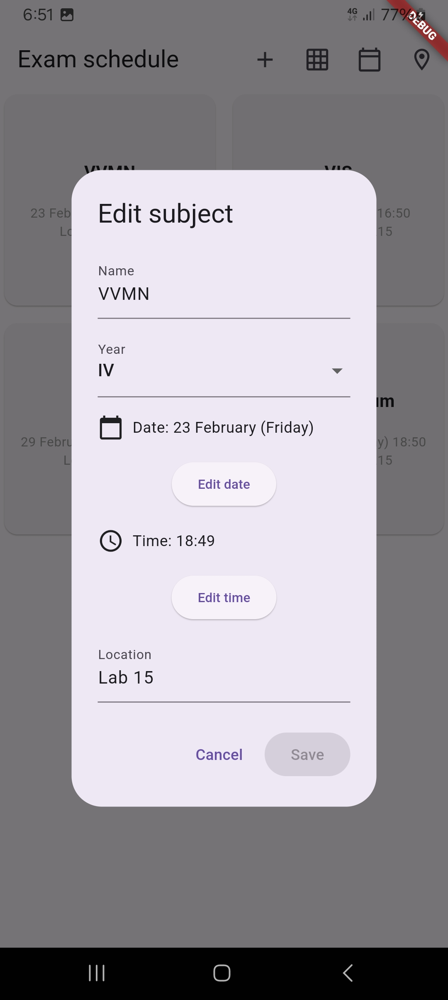
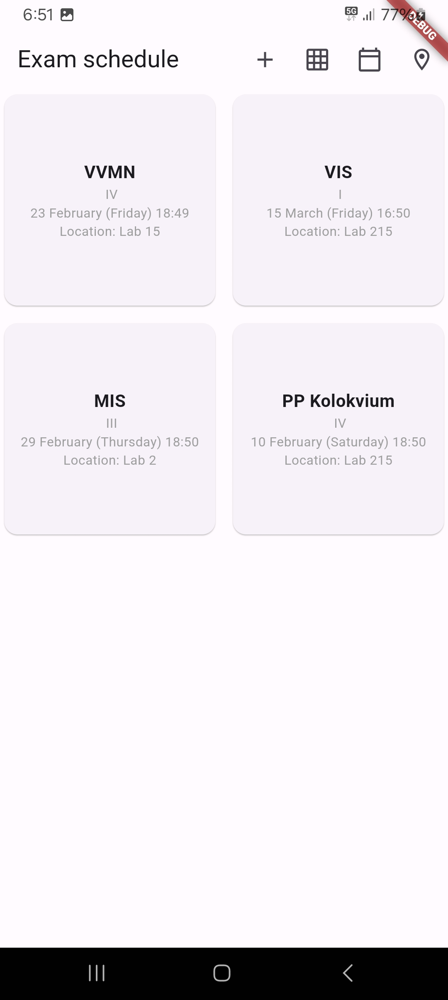

# mis_lab4

Четврта лабораториска вежба по Мобилни информациски системи

Додадени локални нотификации за потсетување за испити/колоквиуми.

Додаден поглед со календар (може да се менува помеѓу grid-от и календарот).

При клик на датум во календарот (ако има испити за тој датум).

Ако нема додадено испити/колоквиуми.
